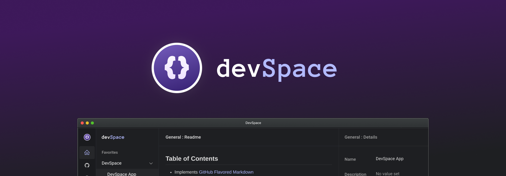

<h1 align="center">
   
  
</h1>

<h4 align="center">
     Rethink how you organize your local projects.
</h4>

    <a href="https://github.com/getdevspace/open-management/issues">
    
    <a href="https://github.com/getdevspace/open-management/pulls">
    
    <a href="https://twitter.com/intent/tweet?text=DevSpace - Rethink how you organize your local projects:&url=https%3A%2F%2Fgetdevspace.com">
    

  <a href="https://getdevspace.com">Website</a> •
  <a href="#installation">Download</a> •
  <a href="#key-features">Features</a> •
  <a href="#wiki">Wiki</a> •
  <a href="CONTRIBUTING.md">Contributing</a> •
  <a href="CODE_OF_CONDUCT.md">Code of Conduct</a>

---

  

## Key Features
👉 Fast and simple project import  
👉 Immediate switch between projects  
👉 Open project in editor  
👉 Overview of git remotes, branches and commits  
👉 Issues and notes tracking tool  
👉 Symbolic link to local assets and show in folder  
👉 Collect external links and open in browser  
👉 Many keyboard shortcuts  

<table>
     <tr>
          <td>
               <h2>
                    It’s time for improvement
               </h2>
               

                    DevSpace is a simple new way to organize and manage your local projects.
               

               

                    It integrates with your coding folder(s) and requires no change to your current structure. Just import your projects to quickly have them organized into DevSpace and get all the supported features for free.
               

               <h2>
                    A central place for gathering everything
               </h2>
               

                    As developers, we know how many tools and resources we have to use when developing a project, and it's really hard to keep them organized.
               

               

                    We often need to get quick project informations, track new and old bugs, manage feature requests and project assets, write immediately a note or bookmark and interesting website.
               

               

                    DevSpace offers you the possibility to save time and increase your productivity by keeping references to all of them in a single app.
               

          </td>
          <td>
               <h4>
                    No setup required
               </h4>
               

                    DevSpace doesn't require any setup to be used with your projects: you just have to import them and that's really all.
               

               <h4>
                    No changes made
               </h4>
               

                    DevSpace doesn't touch any of your project files. Instead, it creates a .devspace folder in your project root to manage all its data. To remove DevSpace from your project, just delete this folder.
               

               <h4>
                    Git integration
               </h4>
               

                    Quickly visualize your commit history to have a clear vision of where are you going, track your remotes and switch between your branches with ease: but don't get confused, this is not a git client.
               

               <h4>
                    Extra assets
               </h4>
               

                    Hands up if your projects have a TODO and NOTES file, you have dozens of external assets, design mockups and more. DevSpace doesn't try to prevent that, just tries to help you organize everything in a better way.
               

          </td>
     </tr>
</table>

## Why not open source

I'm sure a lot of people would love DevSpace to be open source, and trust me, if I had the possibility, for sure I would put everything as public.

Hello, my name is Gabriel, and I'm the author and developer behind DevSpace, and let me say, first of all, that this journey has been amazing so far!

DevSpace is an app I love working on and using, and so I did since February 2020, doing everything myself: desktop app, website, marketing and customer service. But as you may guess, it is not easy to pay bills when you're working so much on a project, and then publish it as open source.

## Open management

Although DevSpace is not open source in the common sense of the term, meaning that the source code is not public, I intend to adopt a strategy of open management, meaning that all issues, bugs, feature requests and roadmaps are publicly available on this GitHub page.

I'll personally use this page to keep everyone up to date with my intentions, talk with people interested in my plans and post a daily development changelog.

If you are interested in letting me know anything, like a feedback, a bug report or would like me to implement a feature, I encourage you to use this GitHub page and post here anything regarding DevSpace, I'm more than glad to help you with anything!

---
